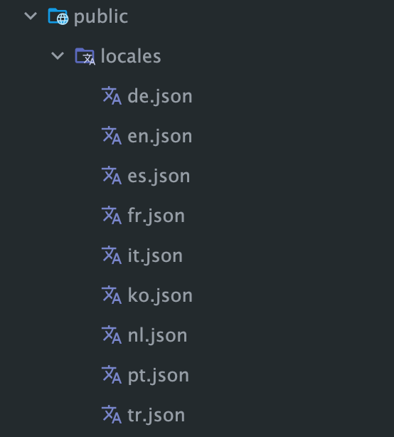

# Nuxt MultiLinguist module

Multilinguist is a simple but smoothly working module for easy and seamless localization implementation for Nuxt applications. 

## Key Features

- Easy translations that you're used to
- Works perfectly fine on both SSR + CSR
- No memory leaks and running out of memory errors
- Autocompletion & validation of keys

## Installation

```bash
npm install @yiiamee/multilinguist
```

Then, add the module to your nuxt.config

```nuxt.config.ts
export default defineNuxtConfig({
    modules: [
        @yiiamee/multilinguist,
    ],
    multilinguist: {
        defaultLocale: "en", // string representing key to your default (fallback) locale
        supportedLanguages: ["en", "es"], // array of strings representing all available locales' keys
    },
})
```

Then, create a "locales" directory in /public directory. This is necessary for module to access your languages.



Now, you're ready to use Multilinguist Module!

# Usage

### t()—famous translate function 
 
```vue
<script setup lang="ts">
const { t } = useMultilinguist(); // Call useMultilinguist composable to get the translation function
  
const pageTitle = computed(() => {
  return t("Hello, World");
});
</script> 

<template>
  <h3>{{ pageTitle }}</h3>
  <button>{{ t("Switch Locale") }}</button>
</template>
```

It also supports nested keys and dynamic keys with variables;
you only need to pass the second argument, an object with used in the key variables: 

```vue
<template>
  <span>{{ t("Paste your variable here", { variable: locale }) }}</span>
</template>
```

And your JSON must look like that:

```json
{
  "Paste your variable here": "Here is your variable: {variable}"
}
```

```vue
<script setup lang="ts">
const { t } = useMultilinguist(); // Call useMultilinguist composable to get the translation function
  
const pageTitle = computed(() => {
  return t("Hello, World");
});
</script> 

<template>
  <h3>{{ pageTitle }}</h3>
  <button>{{ t("Switch Locale") }}</button>
  <br />
  <span>{{ t("Paste your variable here", { variable: locale }) }}</span>
  <br />
  <h1>{{ t("nested.Nested key") }}: <span>{{ t("nested.Language") }}</span></h1>
</template>
```

You can already see how keys auto-completion works:


And validation:


### Set another value to the current locale:

```vue
<script setup lang="ts">
const { t, setLocale } = useMultilinguist();
// setLocale function accepts a string that should match one of defined
// in the nuxt.config strings from supportedLanguages array
  
const pageTitle = computed(() => {
  return t("Hello, World");
});
</script> 

<template>
  <h3>{{ pageTitle }}</h3>
  <button @click="setLocale('es')">{{ t("Switch Locale") }}</button>
</template>
```

### Get current locale

```vue
<script setup lang="ts">
const { t, setLocale, locale } = useMultilinguist();
// locale is SSR friendly, shared among the app ref state  

const pageTitle = computed(() => {
    return t("Hello, World");
});
</script>

<template>
  <h3>{{ pageTitle }}</h3>
  <h6>Current Locale: {{ locale }}</h6>
  <button @click="setLocale('es')">{{ t("Switch Locale") }}</button>
</template>
```